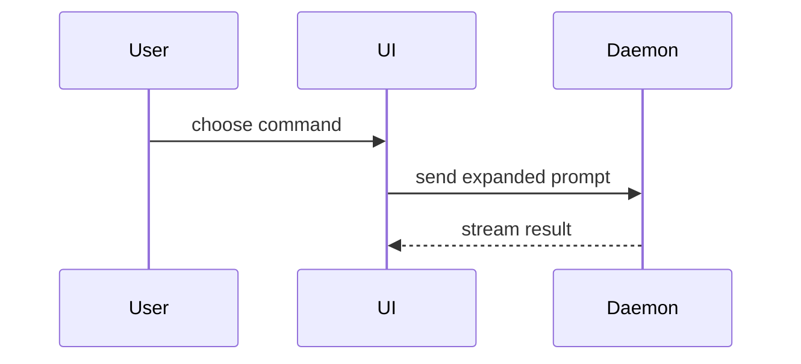

# PR Body

Based on the `show-me` skill by Dex Horthy (Humanlayer).

Use this template for the PR body:

```markdown
## Summary

<diagram, diff-sketch, or tree>

## Evidence

- **Before:** <screenshot/output/failing test run>
  **After:** <screenshot/output/passing test run>

## Merge Danger

**Door:** <one-way or two-way>

<optional: description>

**Blast Radius:** <one-word description>

<optional: potential ramifications of merge>
```

## Sections

Skip all preambles and keep prose brief. Use the project's own domain vocabulary (`GLOSSARY.md` if the repo has one, otherwise the names used in the code and issues).

### Summary

Pick the smallest view that makes the key point clear.

- Show logic or an algorithm as pseudocode:

```text
on(save)
  if content is unchanged
    return cached result
  write new content
  return fresh result
```

- Show runtime control flow as a call tree:

```text
submitForm
  createSession
    persistPrompt
    launchAgent
  navigateToSession
```

- Show UI structure as a component tree, including state and module boundaries that matter:

```text
<SessionPage> (apps/example/src/routes/session.tsx)
  useSessionEvents()
  <SessionToolbar>
    <RunSkillButton> (packages/ui)
```

- Show file responsibility or a broad refactor as a shallow file tree:

```text
src/
├── commands/       # parses user actions
├── sessions/       # owns session state
└── transport/      # sends API requests
```

- Show component interaction, control flow, or data flow with Mermaid:



- Use `diff` when the point is what changes and the surrounding shape already exists. Match the diff shape to the topic: a component tree, a file layout, a call tree, or a state/control-flow sketch.

```diff
 on(save)
-  write content
+  if content is unchanged
+    return cached result
+  write new content
+  invalidate cache
```

- Show the whole block when most of it is new, when omitted context would hide ownership or order, or when the reader needs a copyable target shape.

Place each visual next to the short text it supports. Keep only the calls, files, props, states, and boundaries needed to make the point. You may use one of these, you may use several; it is unlikely you will use all of them. Don't overwhelm the reader.

### Evidence

Concrete evidence that the change works. Show a before and after.

- Screenshots are S-tier when the change is visual and the environment can produce them.
- Execution-based evidence is A-tier: test results, console output. Show the exact test that now fails and passes, as pseudocode if the real test is long.

### Merge Danger

Say whether the change is a **one-way or two-way door**. You can walk back through two-way doors, not one-way doors. A PR that is cheap to roll back is lower risk. Changes that involve destructive actions, data migrations, or hard-to-reverse decisions are one-way doors.

The **blast radius** is the potential scope of impact. Consider all consumers: layout shift, breakages for API consumers, mobile responsiveness, downstream services, etc.

## Creating the PR

When the body is ready, open the PR with `gh pr create` and pass the body via a heredoc or `--body-file` so Markdown and code fences survive intact. Follow `mg:git-feature-branching` for the branch and merge side of things.
